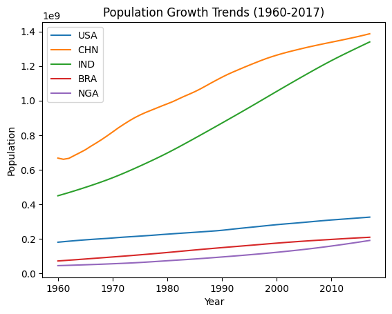

# **WORLD POPULATION GROWTH RATE PREDICTION | DECISION TREE**  
*Global Population Analysis & Forecasting*  

## **INTRODUCTION**  
The world’s population has been growing at an unprecedented rate, impacting **economies, resources, and global policies**. This project applies a **Decision Tree Regression model** to analyze historical population data (1960-2017) and predict future population growth rates.  

By leveraging **data visualization and machine learning**, this project provides insights into **global demographic trends** and the key factors influencing population growth.  

---

## **PROBLEM STATEMENT**  
Understanding and predicting **population growth trends** is critical for:  
- **Government Planning** – Infrastructure, healthcare, and education policies.  
- **Economic Forecasting** – Workforce availability, urbanization trends.  
- **Resource Allocation** – Water, food, and energy demands.  

This project aims to:  
- **Analyze historical world population data** to uncover growth trends.  
- **Identify key factors** influencing population changes.  
- **Develop a Decision Tree model** to predict future population growth rates.  

---

## **SKILL DEMONSTRATION**  
- **Exploratory Data Analysis (EDA)** – Trend analysis and correlation mapping.  
- **Feature Engineering** – Selecting key variables affecting population growth.  
- **Decision Tree Regression** – Training a model for prediction.  
- **Data Visualization** – Growth trends, correlation heatmaps, and model insights.  

---

## **DATA SOURCING**  
The dataset is sourced from [Explore-AI Public Data](https://raw.githubusercontent.com/Explore-AI/Public-Data/master/AnalyseProject/world_population.csv) and includes:  

### **1. Population Data (1960-2017)**  
- **Country Code** – Unique identifier for each country.  
- **Annual Population Estimates** – Population figures from 1960 to 2017.  

### **2. Environmental & Economic Indicators**  
- **Urbanization Rate**  
- **Fertility Rate**  
- **GDP per Capita**  
- **Life Expectancy**  

---

## **EXPLORATORY DATA ANALYSIS (EDA)**  
EDA was conducted to explore **historical population trends** and key drivers.  

### **1. Data Overview**  
- **Checked dataset structure** using `.info()` and `.describe()`.  
- **Identified missing values** and handled inconsistencies.  

### **2. Population Growth Trends**  
- **Line Plot:**  
  ```python
  plt.figure(figsize=(12,6))
  selected_countries = ['USA', 'CHN', 'IND', 'BRA', 'NGA']
  population_df.loc[selected_countries].T.plot()
  plt.title('Population Growth Trends (1960-2017)')
  plt.xlabel('Year')
  plt.ylabel('Population')
  plt.legend(selected_countries)
  plt.show()
  ```

  
- **Key Insight:** India and China show the highest growth, while some countries have stabilized populations.  

### **3. Correlation Analysis**  
- **Heatmap to analyze feature relationships:**  

---

## **DECISION TREE MODEL**  
A **Decision Tree Regression Model** was trained to predict population growth rates.  

### **1. Model Implementation**  
- **Independent Variables (`X`)**: Selected key economic and demographic indicators.  
- **Dependent Variable (`y`)**: Population Growth Rate.  
- **Model Used**: `sklearn.tree.DecisionTreeRegressor`  

### **2. Model Training & Optimization**  
- **Hyperparameter tuning** (`max_depth`, `min_samples_split`).  
- **Cross-validation** to prevent overfitting.  

### **3. Model Evaluation**  
- **Mean Squared Error (MSE)**  
- **Root Mean Squared Error (RMSE)**  
- **R² Score (Explained Variance)**  

---

## **MODEL VISUALIZATION**  
### **1. Decision Tree Structure**  
Visualizing the **Decision Tree splits and decision rules**:  

### **2. Feature Importance**  
Identifying the most **impactful predictors of population growth**:  

---

## **CONCLUSION**  
1. **Fertility rate and urbanization** are major predictors of population growth.  
2. **Decision Tree Regression successfully models growth trends** but requires fine-tuning.  
3. Future improvements should include **ensemble learning (Random Forest, XGBoost)** for better accuracy.  
